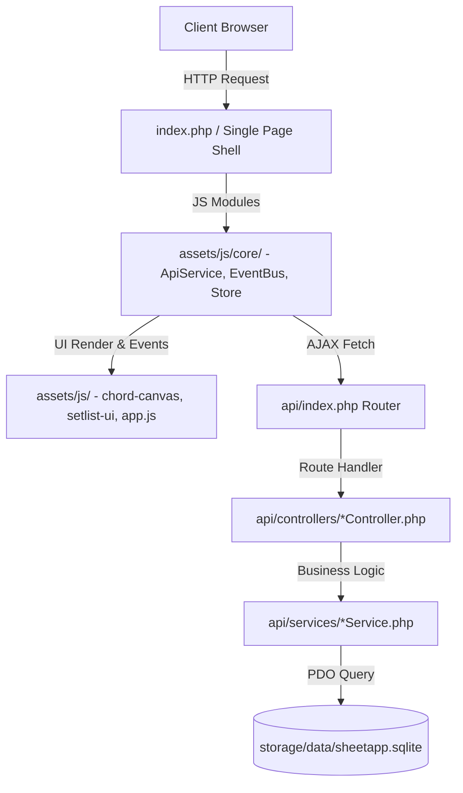

# CODE_MAP.md — Gitnexus Codebase Knowledge Graph & Map (SheetApp)

> **GITNEXUS SECOND BRAIN CODE MAP**
> Bản đồ tri thức toàn bộ hệ thống SheetApp. Cập nhật tự động: 2026-08-06 06:00:44
> AI Agent BẮT BUỘC tra cứu sơ đồ phụ thuộc dưới đây trước khi chỉnh sửa file.

---

## 1 · ARCHITECTURE & CALL HIERARCHY OVERVIEW

---

## 2 · BACKEND MAP (PHP MVC & API ROUTES)

### 2.1 Front Controller / Router
- **File:** `api/index.php`
- **Nhiệm vụ:** Tiếp nhận request, phân tích parameter `route` và `action`, gọi Controller phù hợp và trả JSON chuẩn qua `Response::ok()`.

### 2.2 Controllers (`api/controllers/`)
- **AnnotationController.php**: Handler cho route `annotation`
- **AuthController.php**: Handler cho route `auth`
- **CategoryController.php**: Handler cho route `category`
- **ChordSetController.php**: Handler cho route `chordset`
- **ImportController.php**: Handler cho route `import`
- **LiveSyncController.php**: Handler cho route `livesync`
- **OmrController.php**: Handler cho route `omr`
- **SessionController.php**: Handler cho route `session`
- **SetlistController.php**: Handler cho route `setlist`
- **SongController.php**: Handler cho route `song`
- **UserController.php**: Handler cho route `user`

### 2.3 Services (`api/services/`)
- **AnnotationService.php**: Xử lý logic & truy vấn SQLite cho `Annotation`
- **CategoryService.php**: Xử lý logic & truy vấn SQLite cho `Category`
- **ChordSetService.php**: Xử lý logic & truy vấn SQLite cho `ChordSet`
- **ImportService.php**: Xử lý logic & truy vấn SQLite cho `Import`
- **LiveSyncService.php**: Xử lý logic & truy vấn SQLite cho `LiveSync`
- **OmrService.php**: Xử lý logic & truy vấn SQLite cho `Omr`
- **SessionService.php**: Xử lý logic & truy vấn SQLite cho `Session`
- **SetlistService.php**: Xử lý logic & truy vấn SQLite cho `Setlist`
- **SongService.php**: Xử lý logic & truy vấn SQLite cho `Song`
- **UserService.php**: Xử lý logic & truy vấn SQLite cho `User`

---

## 3 · FRONTEND MAP (JAVASCRIPT MODULE DEPENDENCY)

### 3.1 Core Infrastructure (`assets/js/core/`)
- `assets/js/core/ApiService.js` — Wrapper tập trung cho mọi cuộc gọi `fetch()` API.
- `assets/js/core/EventBus.js` — Hệ thống Pub/Sub giao tiếp giữa các UI modules.
- `assets/js/core/Store.js` — Quản lý trạng thái chung (Current Song, Setlist, User Settings).

### 3.2 Feature Modules
- `assets/js/admin-ui.js`
- `assets/js/annotation-canvas.js`
- `assets/js/app-ui.js`
- `assets/js/app.js`
- `assets/js/audio-player.js`
- `assets/js/auth.js`
- `assets/js/auto-scroller.js`
- `assets/js/chord-canvas-ui.js`
- `assets/js/chord-canvas-xml.js`
- `assets/js/chord-canvas.js`
- `assets/js/display-settings.js`
- `assets/js/fab.js`
- `assets/js/history-manager.js`
- `assets/js/importer.js`
- `assets/js/instruments.js`
- `assets/js/keyboard-handler.js`
- `assets/js/library-ui.js`
- `assets/js/live-sync.js`
- `assets/js/lyric-extractor.js`
- `assets/js/metronome.js`
- `assets/js/osmd-renderer.js`
- `assets/js/page-nav.js`
- `assets/js/performance-notes.js`
- `assets/js/session-tracker.js`
- `assets/js/setlist-ui.js`
- `assets/js/song-info-bar.js`
- `assets/js/song-loader.js`
- `assets/js/toolbar-controller.js`
- `assets/js/transpose-engine.js`
- `assets/js/url-state.js`

---

## 4 · DATABASE SCHEMA & STORAGE MAP
- **Main Database:** `storage/data/sheetapp.sqlite`
- **Core Tables:**
  - `songs` (id, title, artist, key, tempo, content, pdf_path...)
  - `chord_sets` (id, song_id, set_name, map_json...) — *Lưu ý: Set 'HD' và 'default' bị khóa xóa*
  - `setlists` & `setlist_items` (id, name, bpm, beats_per_measure, transpose_override...)
  - `annotations` (id, song_id, canvas_data...)

---

## 5 · FILE REGISTRY INDEX (2900 files total)
Total indexed files: 2900
