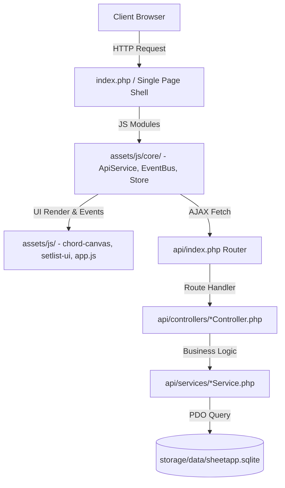

# CODE_MAP.md — Gitnexus Codebase Knowledge Graph & Map (SheetApp)

> **GITNEXUS SECOND BRAIN CODE MAP**
> Bản đồ tri thức toàn bộ hệ thống SheetApp. Cập nhật tự động: 2026-09-28 13:07:55
> AI Agent BẮT BUỘC tra cứu sơ đồ phụ thuộc dưới đây trước khi chỉnh sửa file.

---

## 1 · ARCHITECTURE & CALL HIERARCHY OVERVIEW

```mermaid
graph TD
    User[Client Browser] -->|HTTP Request| Entry[index.php / Single Page Shell]
    Entry -->|JS Modules| FrontendCore[assets/js/core/ - ApiService, EventBus, Store]
    FrontendCore -->|UI Render & Events| UIComponents[assets/js/ - chord-canvas, setlist-ui, app.js]
    FrontendCore -->|AJAX Fetch| APIFront[api/index.php Router]
    
    APIFront -->|Route Handler| Controllers[api/controllers/*Controller.php]
    Controllers -->|Business Logic| Services[api/services/*Service.php]
    Services -->|PDO Query| DB[(storage/data/sheetapp.sqlite)]
```

---

## 2 · BACKEND MAP (PHP MVC & API ROUTES)

### 2.1 Front Controller / Router
- **File:** `api/index.php`
- **Nhiệm vụ:** Tiếp nhận request, phân tích parameter `route` và `action`, gọi Controller phù hợp và trả JSON chuẩn qua `Response::ok()`.

### 2.2 Controllers (`api/controllers/`)
- **AnnotationController.php**: Handler cho route `annotation`
- **ArrangementController.php**: Handler cho route `arrangement`
- **AuthController.php**: Handler cho route `auth`
- **CategoryController.php**: Handler cho route `category`
- **ChordSetController.php**: Handler cho route `chordset`
- **ExportController.php**: Handler cho route `export`
- **ImportController.php**: Handler cho route `import`
- **LearningController.php**: Handler cho route `learning`
- **LiveSyncController.php**: Handler cho route `livesync`
- **ManagerController.php**: Handler cho route `manager`
- **NotificationController.php**: Handler cho route `notification`
- **NotificationPreferenceController.php**: Handler cho route `notificationpreference`
- **OmrController.php**: Handler cho route `omr`
- **PracticeAssignmentController.php**: Handler cho route `practiceassignment`
- **PracticeController.php**: Handler cho route `practice`
- **ReviewController.php**: Handler cho route `review`
- **SessionController.php**: Handler cho route `session`
- **SetlistController.php**: Handler cho route `setlist`
- **SongController.php**: Handler cho route `song`
- **UserController.php**: Handler cho route `user`

### 2.3 Services (`api/services/`)
- **AnnotationService.php**: Xử lý logic & truy vấn SQLite cho `Annotation`
- **ArrangementService.php**: Xử lý logic & truy vấn SQLite cho `Arrangement`
- **CategoryService.php**: Xử lý logic & truy vấn SQLite cho `Category`
- **ChordProService.php**: Xử lý logic & truy vấn SQLite cho `ChordPro`
- **ChordSetService.php**: Xử lý logic & truy vấn SQLite cho `ChordSet`
- **DomainEventService.php**: Xử lý logic & truy vấn SQLite cho `DomainEvent`
- **ImportService.php**: Xử lý logic & truy vấn SQLite cho `Import`
- **LearningService.php**: Xử lý logic & truy vấn SQLite cho `Learning`
- **LiveSyncService.php**: Xử lý logic & truy vấn SQLite cho `LiveSync`
- **LiveSyncStorageHelper.php**: Xử lý logic & truy vấn SQLite cho `LiveSyncStorageHelper.php`
- **ManagerRepertoireHelper.php**: Xử lý logic & truy vấn SQLite cho `ManagerRepertoireHelper.php`
- **ManagerService.php**: Xử lý logic & truy vấn SQLite cho `Manager`
- **ManagerUserHelper.php**: Xử lý logic & truy vấn SQLite cho `ManagerUserHelper.php`
- **NotificationDeliveryService.php**: Xử lý logic & truy vấn SQLite cho `NotificationDelivery`
- **NotificationPreferenceService.php**: Xử lý logic & truy vấn SQLite cho `NotificationPreference`
- **NotificationService.php**: Xử lý logic & truy vấn SQLite cho `Notification`
- **OmrService.php**: Xử lý logic & truy vấn SQLite cho `Omr`
- **PracticeAssignmentCreationHelper.php**: Xử lý logic & truy vấn SQLite cho `PracticeAssignmentCreationHelper.php`
- **PracticeAssignmentService.php**: Xử lý logic & truy vấn SQLite cho `PracticeAssignment`
- **PracticeService.php**: Xử lý logic & truy vấn SQLite cho `Practice`
- **ReviewActionHelper.php**: Xử lý logic & truy vấn SQLite cho `ReviewActionHelper.php`
- **ReviewDiffEngine.php**: Xử lý logic & truy vấn SQLite cho `ReviewDiffEngine.php`
- **ReviewService.php**: Xử lý logic & truy vấn SQLite cho `Review`
- **SessionService.php**: Xử lý logic & truy vấn SQLite cho `Session`
- **SetlistOfflineHelper.php**: Xử lý logic & truy vấn SQLite cho `SetlistOfflineHelper.php`
- **SetlistService.php**: Xử lý logic & truy vấn SQLite cho `Setlist`
- **SetlistUsageHelper.php**: Xử lý logic & truy vấn SQLite cho `SetlistUsageHelper.php`
- **SongSearchHelper.php**: Xử lý logic & truy vấn SQLite cho `SongSearchHelper.php`
- **SongService.php**: Xử lý logic & truy vấn SQLite cho `Song`
- **SongVersionHelper.php**: Xử lý logic & truy vấn SQLite cho `SongVersionHelper.php`
- **TransposeHelper.php**: Xử lý logic & truy vấn SQLite cho `TransposeHelper.php`
- **UserService.php**: Xử lý logic & truy vấn SQLite cho `User`

---

## 3 · FRONTEND MAP (JAVASCRIPT MODULE DEPENDENCY)

### 3.1 Core Infrastructure (`assets/js/core/`)
- `assets/js/core/ApiService.js` — Wrapper tập trung cho mọi cuộc gọi `fetch()` API.
- `assets/js/core/EventBus.js` — Hệ thống Pub/Sub giao tiếp giữa các UI modules.
- `assets/js/core/Store.js` — Quản lý trạng thái chung (Current Song, Setlist, User Settings).

### 3.2 Feature Modules
- `assets\js\admin-ui.js`
- `assets\js\annotation-canvas.js`
- `assets\js\app-ui.js`
- `assets\js\app.js`
- `assets\js\audio-player.js`
- `assets\js\auth.js`
- `assets\js\auto-scroller.js`
- `assets\js\bass-lens.js`
- `assets\js\chord-canvas-dots.js`
- `assets\js\chord-canvas-edit.js`
- `assets\js\chord-canvas-transpose.js`
- `assets\js\chord-canvas-ui.js`
- `assets\js\chord-canvas-xml.js`
- `assets\js\chord-canvas.js`
- `assets\js\core\ApiService.js`
- `assets\js\core\AppShell.js`
- `assets\js\core\AudioUnlocker.js`
- `assets\js\core\ErrorReporter.js`
- `assets\js\core\EventBus.js`
- `assets\js\core\FeatureFlags.js`
- `assets\js\core\KeyService.js`
- `assets\js\core\MidiEngine.js`
- `assets\js\core\ModalManager.js`
- `assets\js\core\ModeManager.js`
- `assets\js\core\OfflineSetlistManager.js`
- `assets\js\core\SafeHtml.js`
- `assets\js\core\ScriptLoader.js`
- `assets\js\core\ServiceWorkerManager.js`
- `assets\js\core\SongLoaderCore.js`
- `assets\js\core\Store.js`
- `assets\js\core\TapTempo.js`
- `assets\js\core\VerseManager.js`
- `assets\js\core\XmlDocCache.js`
- `assets\js\display-settings.js`
- `assets\js\drums-lens.js`
- `assets\js\fab.js`
- `assets\js\follow-leader.js`
- `assets\js\guitar-lens.js`
- `assets\js\harmonic-numeral.js`
- `assets\js\history-manager.js`
- `assets\js\importer.js`
- `assets\js\instruments.js`
- `assets\js\key-service.js`
- `assets\js\keyboard-handler.js`
- `assets\js\leader-notes-banner.js`
- `assets\js\learn\accompaniment\pattern-engine.js`
- `assets\js\learn\accompaniment\pattern-generator.js`
- `assets\js\learn\accompaniment\pattern-library.js`
- `assets\js\learn\accompaniment\pattern-scheduler.js`
- `assets\js\learn\audio\learn-sound-engine.js`
- `assets\js\learn\harmony\learn-satb.js`
- `assets\js\learn\harmony\voicing-engine.js`
- `assets\js\learn\learn-app.js`
- `assets\js\learn\learn-interfaces.js`
- `assets\js\learn\learn-store.js`
- `assets\js\learn\midi\midi-input-engine.js`
- `assets\js\learn\practice\chord-judge.js`
- `assets\js\learn\practice\loop-controller.js`
- `assets\js\learn\practice\melody-practice-engine.js`
- `assets\js\learn\practice\practice-tracker.js`
- `assets\js\learn\timeline\chord-timeline-normalizer.js`
- `assets\js\learn\transport\learn-transport-bridge.js`
- `assets\js\learn\transport\music-transport.js`
- `assets\js\learn\ui\chord-card.js`
- `assets\js\learn\ui\learn-assignments-ui.js`
- `assets\js\learn\ui\learn-controls.js`
- `assets\js\learn\ui\learn-dashboard-ui.js`
- `assets\js\learn\ui\learn-score.js`
- `assets\js\learn\ui\virtual-keyboard.js`
- `assets\js\library-ui.js`
- `assets\js\liturgy-card.js`
- `assets\js\live-sync.js`
- `assets\js\lyric-extractor.js`
- `assets\js\metronome.js`
- `assets\js\mobile-controller.js`
- `assets\js\modals\HelpModal.js`
- `assets\js\modals\PracticeTeamBoardModal.js`
- `assets\js\modals\QuickNumpadModal.js`
- `assets\js\modals\ServicePlanAssignModal.js`
- `assets\js\modals\TempoPickerSheet.js`
- `assets\js\modals\TransposePickerModal.js`
- `assets\js\osmd-renderer.js`
- `assets\js\osmd-svg-text.js`
- `assets\js\page-nav.js`
- `assets\js\performance\ambient-pad-engine.js`
- `assets\js\performance\arrangement-engine.js`
- `assets\js\performance\count-in-engine.js`
- `assets\js\performance\cue-engine.js`
- `assets\js\performance\live-session.js`
- `assets\js\performance\live-transport.js`
- `assets\js\performance\musical-position.js`
- `assets\js\performance\pedal-midi-engine.js`
- `assets\js\performance\performance-engine.js`
- `assets\js\performance\qr-helper.js`
- `assets\js\performance\stage-ink-engine.js`
- `assets\js\performance\transport-clock.js`
- `assets\js\performance-notes.js`
- `assets\js\service-plan-ui.js`
- `assets\js\session-tracker.js`
- `assets\js\setlist-detail.js`
- `assets\js\setlist-list.js`
- `assets\js\setlist-player.js`
- `assets\js\setlist-ui.js`
- `assets\js\song-info-bar.js`
- `assets\js\song-loader.js`
- `assets\js\song-preloader.js`
- `assets\js\stage-lens.js`
- `assets\js\toolbar-controller.js`
- `assets\js\transpose-engine.js`
- `assets\js\url-state.js`
- `assets\js\vocals-lens.js`

---

## 4 · DATABASE SCHEMA & STORAGE MAP
- **Main Database:** `storage/data/sheetapp.sqlite`
- **Core Tables:**
  - `songs` (id, title, artist, key, tempo, content, pdf_path...)
  - `chord_sets` (id, song_id, set_name, map_json...) — *Lưu ý: Set 'HD' và 'default' bị khóa xóa*
  - `setlists` & `setlist_items` (id, name, bpm, beats_per_measure, transpose_override...)
  - `annotations` (id, song_id, canvas_data...)

---

## 5 · FILE REGISTRY INDEX (1952 files total)
Total indexed files: 1952
