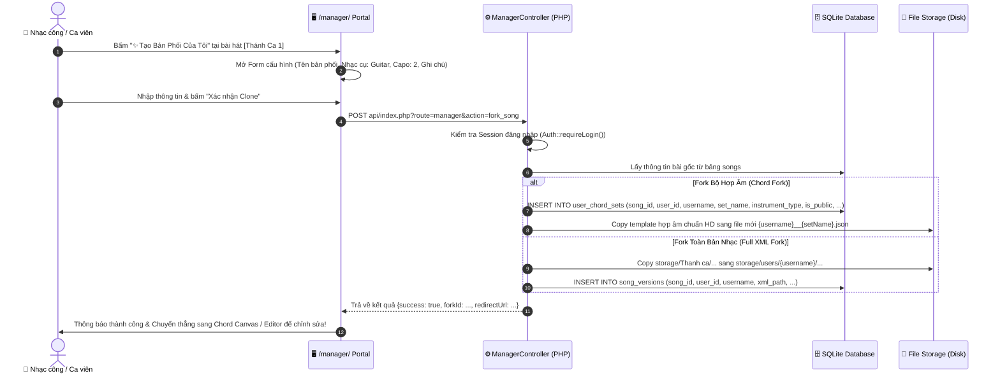
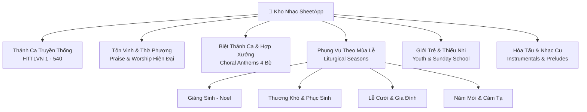

# SHEETAPP2 — BÁO CÁO PHÂN TÍCH CHUYÊN SÂU & THIẾT KẾ KIẾN TRÚC PHÂN HỆ QUẢN LÝ TẬP TRUNG (`/manager/`)

> **Phiên bản tài liệu:** 2.0 — Enterprise Multi-User Repertoire & Collaborative Chord Ecosystem  
> **Ngày lập báo cáo:** 10/09/2026  
> **Hệ thống áp dụng:** `https://sheet.hyb.io.vn/manager/`  
> **Đối tượng áp dụng:** Ban Quản Trị Dự Án, Ban Hát / Ca Đoàn, Nhạc Công (Guitar/Piano/Bass/Trống), AI Engineering Agents (Antigravity / Gemini Flash).

---

## MỤC LỤC TỔNG QUAN

1. [TỔNG QUAN & TẦM NHÌN ĐIỀU HÀNH](#1-tổng-quan--tầm-nhìn-điều-hành)
2. [MA TRẬN NGUYÊN TẮC CỐT LÕI (CORE PRINCIPLES & GUARD-RAILS)](#2-ma-trận-nguyên-tắc-cốt-lõi-core-principles--guard-rails)
3. [CƠ CHẾ FORK / CLONE BẢN NHẠC (ZERO-OVERWRITE MASTER PROTECTION)](#3-cơ-chế-fork--clone-bản-nhạc-zero-overwrite-master-protection)
4. [CƠ CHẾ CỘNG ĐỒNG CÔNG KHAI CÓ GHI NHẬN TÁC GIẢ (PUBLIC ATTRIBUTION & COLLABORATION)](#4-cơ-chế-cộng-đồng-công-khai-có-ghi-nhận-tác-giả-public-attribution--collaboration)
5. [HỆ THỐNG PHÂN LOẠI ĐA DANH MỤC (MULTI-CATEGORY REPERTOIRE TAXONOMY)](#5-hệ-thống-phân-loại-đa-danh-mục-multi-category-repertoire-taxonomy)
6. [THIẾT KẾ CƠ SỞ DỮ LIỆU CHUYÊN SÂU (SQLITE EXTENDED SCHEMA)](#6-thiết-kế-cơ-sở-dữ-liệu-chuyên-sâu-sqlite-extended-schema)
7. [ĐẶC TẢ API RESTFUL & BACKEND ARCHITECTURE](#7-đặc-tả-api-restful--backend-architecture)
8. [THIẾT KẾ GIAO DIỆN & TRẢI NGHIỆM NGƯỜI DÙNG (/manager/ UI/UX)](#8-thiết-kế-giao-diện--trải-nghiệm-người-dùng-manager-uiux)
9. [MA TRẬN TÁC ĐỘNG & TÍNH TƯƠNG THÍCH NGƯỢC (IMPACT & BACKWARD COMPATIBILITY)](#9-ma-trận-tác-động--tính-tương-thích-ngược-impact--backward-compatibility)
10. [LỘ TRÌNH TRIỂN KHAI THEO GIAI ĐOẠN (IMPLEMENTATION ROADMAP)](#10-lộ-trình-triển-khai-theo-giai-đoạn-implementation-roadmap)

---

# 1. TỔNG QUAN & TẦM NHÌN ĐIỀU HÀNH

### 1.1 Hiện Trạng Cũ & Sự Cần Thiết Ra Đời Của `/manager/`
Hiện tại, trang SheetApp đã có một giao diện phụ Admin nằm trong cửa sổ bật lên (popup modal `#admin-modal` trong `includes/admin_console.php`). Mặc dù modal này đáp ứng một số tác vụ cơ bản như Import URL, tạo User đơn giản, và danh sách bài hát, nhưng nó bộc lộ những hạn chế lớn khi quy mô ban nhạc và ca đoàn mở rộng:
1. **Không gian thao tác chật hẹp:** Modal 85vh trên trình duyệt khiến việc quản lý danh sách hàng trăm bài hát, xem trước hợp âm, và phân quyền người dùng trở nên tù túng.
2. **Thiếu cơ chế quản lý bộ hợp âm người dùng:** Nhạc công (guitar, piano, bass) mỗi người có một phong cách hòa âm riêng (chơi hợp âm màu 7M, 9, sus4, hay chơi đơn giản ballad). Hiện tại, việc tạo bộ hợp âm mới chỉ lưu dạng file JSON phân tán trong `storage/data/chord_sets/`, thiếu metadata định danh ai là người tạo, thuộc nhạc cụ nào, và không thể phân loại theo từng thành viên.
3. **Nguy cơ ghi đè bản gốc:** Khi nhiều người cùng tham gia biên tập, nếu không có cơ chế phân tách rõ ràng giữa **Bản Gốc Master (Hội Thánh)** và **Bản Phối Cá Nhân (User Variant)**, nguy cơ ghi đè làm sai lệch bản nhạc chuẩn mực là rất cao.

### 1.2 Tầm Nhìn Chiến Lược: "Trung Tâm Điều Hành Kho Nhạc & Không Gian Cộng Tác Thành Viên"
Cổng điều hành độc lập tại `https://sheet.hyb.io.vn/manager/` được thiết kế như một **Hub trung tâm** kết nối giữa:
- **Người quản trị (Admin / Ca Trưởng):** Kiểm soát kho nhạc, duyệt bản chuẩn, phân quyền tài khoản, phân loại danh mục, ghim các bản phối xuất sắc.
- **Thành viên sáng tạo (Nhạc công / Ca viên):** Khi đăng nhập, mỗi thành viên có không gian riêng để clone bài hát từ kho gốc, tự do đặt hợp âm, viết hướng dẫn chơi đàn mà không sợ làm hỏng bản gốc.
- **Cộng đồng sử dụng (Toàn bộ ban nhạc & ca đoàn):** Mọi bản phối, bộ hợp âm do bất kỳ ai tạo ra đều được **hiển thị công khai** kèm theo tên tác giả rõ ràng, cho phép bất kỳ ai cũng có thể tìm kiếm, chọn dùng và đánh giá trong các buổi tập hoặc thánh lễ trực tiếp.

```
                    ┌──────────────────────────────────────────────┐
                    │       BẢN GỐC HỘI THÁNH (MASTER HTTLVN)      │
                    │   - Nốt nhạc & Lời chuẩn mực (Read-Only)     │
                    │   - Hợp âm mặc định & Preset chuẩn HD        │
                    └──────────────────────┬───────────────────────┘
                                           │
                        [HÀNH ĐỘNG: CLONE / FORK TỰ ĐỘNG]
                                           │
         ┌─────────────────────────────────┴─────────────────────────────────┐
         ▼                                                                   ▼
┌─────────────────────────────────┐                         ┌─────────────────────────────────┐
│  Bản Phối của @nam_guitar       │                         │  Bản Phối của @minh_piano       │
│  - Thể loại: Ballad Rải         │                         │  - Thể loại: Jazz Reharmonized  │
│  - Capo 2, Hợp âm Guitar màu    │                         │  - Nốt bè Piano, Voicing mở rộng│
└────────────────┬────────────────┘                         └────────────────┬────────────────┘
                 │                                                           │
                 └─────────────────────────┬─────────────────────────────────┘
                                           ▼
                    ┌──────────────────────────────────────────────┐
                    │      CỘNG ĐỒNG CÔNG KHAI CÓ GHI NHẬN TÁC GIẢ   │
                    │   - Hiển thị cho toàn bộ ban nhạc & ca đoàn  │
                    │   - Lọc theo Danh Mục & Lọc theo Nhạc Công   │
                    │   - Đánh dấu ⭐ Ca Trưởng Khuyên Dùng        │
                    └──────────────────────────────────────────────┘
```

---

# 2. MA TRẬN NGUYÊN TẮC CỐT LÕI (CORE PRINCIPLES & GUARD-RAILS)

Để đảm bảo hệ thống vừa linh hoạt cho người dùng sáng tạo, vừa an toàn tuyệt đối cho kho dữ liệu hội thánh, phân hệ `/manager/` tuân thủ 4 nguyên tắc bất di bất dịch:

| STT | Nguyên Tắc Cốt Lõi | Cơ Chế Đảm Bảo Kỹ Thuật | Ý Nghĩa Thực Tiễn |
| :--- | :--- | :--- | :--- |
| **1** | **Bản Gốc Bất Khả Xâm Phạm** *(Master Sanctity)* | Backend chặn mọi request `save_xml` hoặc ghi đè file trong `storage/Thanh ca/` đối với tài khoản không phải Super Admin. | Tránh hoàn toàn việc một nhạc công vô tình làm mất nốt nhạc hay thay đổi lời bài hát chuẩn của hội thánh. |
| **2** | **Cơ Chế Clone Tự Động** *(Auto-Fork on Edit)* | Khi người dùng bấm "Tạo bản phối" hoặc chỉnh sửa hợp âm trên một bài hát gốc, hệ thống tự động sinh bản sao (Fork) gán với `user_id` của họ. | Người dùng hoàn toàn tự tin thử nghiệm các hòa âm phức tạp mà không sợ gây lỗi hệ thống. |
| **3** | **Công Khai Kèm Ghi Nhận Tác Giả** *(Attribution by Default)* | Mặc định mọi bản clone / bộ hợp âm mới đều có cờ `is_public = 1` và lưu đầy đủ thông tin: Người tạo, Thời gian, Nhạc cụ, Tên bản phối. | Tận dụng trí tuệ tập thể: cả ban nhạc đều có thể học hỏi và sử dụng bản phối của nhau. |
| **4** | **Phân Loại Danh Mục Đa Tầng** *(Taxonomy Integrity)* | Mọi bài hát và bản phối đều liên kết chặt chẽ với Cây Danh Mục (`categories`). Cho phép lọc chéo: [Danh mục] × [Người tạo]. | Giúp tìm kiếm siêu tốc trong các dịp lễ đặc thù (Giáng sinh, Phục sinh, Hôn lễ...). |

---

# 3. CƠ CHẾ FORK / CLONE BẢN NHẠC (ZERO-OVERWRITE MASTER PROTECTION)

### 3.1 Hai Cấp Độ Clone (Dual-Level Forking Model)
Khi người dùng muốn tùy biến một bài hát trong kho nhạc, hệ thống cung cấp 2 cấp độ Clone tùy theo nhu cầu:

#### Cấp độ 1: Clone Bộ Hợp Âm (Chord Set Fork — Nhẹ, Tức Thì, Phổ Biến Nhất)
- **Đối tượng:** Dành cho Nhạc công (Guitarist, Pianist, Bassist) chỉ muốn đổi hợp âm, đặt hợp âm mới, đổi thế bấm Capo hoặc ghi chú hòa thanh mà không can thiệp vào nốt nhạc gốc.
- **Cơ chế lưu trữ:** 
  * Không nhân bản file MusicXML (tiết kiệm 99% dung lượng đĩa).
  * Tạo một bản ghi trong bảng `user_chord_sets` và lưu file JSON hợp âm tại `storage/data/chord_sets/{songId}/{username}__{setName}.json`.
  * Metadata lưu trữ: `song_id`, `user_id`, `username`, `set_name`, `instrument_type`, `capo_fret`, `notes`.

#### Cấp độ 2: Clone Toàn Bộ Bản Nhạc (Full MusicXML Score Fork — Chuyên Sâu)
- **Đối tượng:** Dành cho Ca Trưởng, Người chuyển soạn (Arranger) muốn sửa trực tiếp khuông nhạc bằng Visual Editor (`/editor/`): phân chia bè SATB, đổi nhịp điệu, chỉnh cao độ nốt, thêm ô nhịp dạo (Intro/Outro).
- **Cơ chế lưu trữ:**
  * Hệ thống copy file MusicXML gốc sang thư mục riêng của người dùng: `storage/users/{username}/{songId}/{versionSlug}.xml`.
  * Tạo bản ghi trong bảng `song_versions` với liên kết `parent_song_id`.
  * Tự động sinh file dự phòng `.bak` để khôi phục khi cần.

### 3.2 Luồng Dữ Liệu Thực Thi Fork (Fork Execution Flow)



---

# 4. CƠ CHẾ CỘNG ĐỒNG CÔNG KHAI CÓ GHI NHẬN TÁC GIẢ (PUBLIC ATTRIBUTION & COLLABORATION)

### 4.1 Khắc Phục Nhược Điểm "Lưu Riêng Tư"
Yêu cầu trọng tâm của dự án:  
> *"tuy vậy vẫn sẽ cho hiển thị cho bất kỳ ai sẽ lưu lại của người nào để phân loại chứ không phải riêng người đó"*

Nếu bản clone chỉ lưu riêng tư cho cá nhân:
- Các nhạc công khác trong ban không thể biết người trước đã soạn những gì.
- Ca Trưởng không thể chọn bộ hợp âm của nhạc công đó vào Setlist thờ phượng.
- Gây lãng phí công sức khi nhiều người phải tự làm lại từ đầu cùng một bài.

**Giải pháp của SheetApp 2.0:**
Tất cả các bản clone / bộ hợp âm mới đều được **Công Khai Ngay Lập Tức (Public by Default)** cho bất kỳ ai truy cập web, nhưng được **Ghi Nhận Tác Quyền / Tác Giả Đóng Góp (Author Attribution)** tuyệt đối minh bạch:

```
┌─────────────────────────────────────────────────────────────────────────────────┐
│ 🎵 THÁNH CA 1: CÚI XIN VUA THÁNH NGỰ LẠI                                        │
├─────────────────────────────────────────────────────────────────────────────────┤
│ [⭐ Bản Gốc HTTLVN]        TLH Master • Giọng F • 4 bè SATB chuẩn               │
│ [⭐ Bản Chuẩn HD]          Bộ hợp âm chuẩn Ban Hát • Biên tập: Admin             │
│ [🎸 Bản Acoustic Ban Trẻ]  Soạn bởi: @nam_guitar • Cập nhật: 10/09 • 18 hợp âm   │
│ [🎹 Bản Jazz Reharm]       Soạn bởi: @minh_piano • Cập nhật: 08/09 • 32 hợp âm   │
│ [🎻 Bản Dây & Dạo Đầu]     Soạn bởi: @lan_violin • Cập nhật: 02/09 • Kèm Intro    │
└─────────────────────────────────────────────────────────────────────────────────┘
```

### 4.2 Hệ Thống Huy Hiệu & Phân Quyền Đóng Góp (Badge & Trust Hierarchy)

1. **Huy hiệu Tác Giả (Author Tag):**
   - Mỗi bộ hợp âm đều hiển thị avatar nhỏ + username + vai trò của người soạn (ví dụ: `[🎸 Nam - Guitar chính]`).
2. **Huy hiệu Ca Trưởng Khuyên Dùng (⭐ Recommended / Curated):**
   - Admin hoặc Ca Trưởng có quyền bấm ghim "Khuyên dùng cho buổi lễ". Bộ hợp âm này sẽ xuất hiện trên cùng kèm viền ánh vàng để toàn ban ưu tiên chọn.
3. **Bộ Lọc Đóng Góp Theo Thành Viên (Filter by Contributor):**
   - Trong `/manager/`, người dùng có thể bấm vào tên của bất kỳ ai để xem toàn bộ "gia tài âm nhạc" của người đó:
     * *Ví dụ: "Xem tất cả 25 bộ hợp âm do anh Nam soạn"*, *"Xem các bài do chị Lan chuyển soạn"*.

---

# 5. HỆ THỐNG PHÂN LOẠI ĐA DANH MỤC (MULTI-CATEGORY REPERTOIRE TAXONOMY)

### 5.1 Cấu Trúc Cây Danh Mục Kho Nhạc Hội Thánh
Kho nhạc được phân cấp rõ ràng theo các chủ đề và mùa lễ phụng vụ:



### 5.2 Tính Năng Quản Lý Danh Mục Tại `/manager/`
1. **Duyệt bài theo Danh mục tương tác:** Lọc tức thì các bài hát theo từng thể loại với số lượng hiển thị thời gian thực.
2. **Quản lý Thể loại (Category CRUD):** Admin có thể tạo thêm danh mục mới, đổi tên, thay đổi slug và icon nhận diện.
3. **Phân loại hàng loạt (Batch Categorization):** Chọn nhiều bài hát cùng lúc và di chuyển sang thể loại mong muốn chỉ bằng 1 thao tác.
4. **Thống kê chuyên sâu (Category Analytics):** Thống kê danh mục nào có nhiều bài nhất, danh mục nào có nhiều bản phối của thành viên đóng góp nhất.

---

# 6. THIẾT KẾ CƠ SỞ DỮ LIỆU CHUYÊN SÂU (SQLITE EXTENDED SCHEMA)

Để hỗ trợ toàn diện các yêu cầu trên, CSDL SQLite (`storage/data/sheetapp.sqlite`) được nâng cấp mở rộng cấu trúc như sau:

### 6.1 Mở Rộng Bảng `users` (Hồ Sơ Thành Viên Đóng Góp)
```sql
ALTER TABLE users ADD COLUMN display_name TEXT;       -- Tên hiển thị (VD: Hoàng Nam)
ALTER TABLE users ADD COLUMN instrument TEXT;         -- Nhạc cụ chính (guitar, piano, bass, drums, vocal)
ALTER TABLE users ADD COLUMN avatar_url TEXT;          -- Ảnh đại diện
ALTER TABLE users ADD COLUMN bio TEXT;                 -- Giới thiệu ngắn
ALTER TABLE users ADD COLUMN status TEXT DEFAULT 'active'; -- Trạng thái (active, suspended)
```

### 6.2 Bảng Mới `user_chord_sets` (Bộ Hợp Âm Do Người Dùng Tạo & Công Khai)
Bảng này quản lý toàn bộ các bộ hợp âm tùy biến của từng người dùng, thay thế việc lưu file thô không kiểm soát:
```sql
CREATE TABLE IF NOT EXISTS user_chord_sets (
    id INTEGER PRIMARY KEY AUTOINCREMENT,
    song_id TEXT NOT NULL,                             -- Khóa ngoại liên kết bảng songs
    user_id INTEGER NOT NULL,                           -- Người tạo (Khóa ngoại bảng users)
    username TEXT NOT NULL,                             -- Tên đăng nhập người tạo (cache để truy vấn nhanh)
    set_name TEXT NOT NULL,                             -- Tên bộ hợp âm (VD: "Acoustic Rải", "Jazz Màu")
    instrument_type TEXT NOT NULL DEFAULT 'guitar',     -- guitar | piano | bass | general
    capo_fret INTEGER NOT NULL DEFAULT 0,               -- Kẹp capo khuyến nghị (0 = không kẹp)
    custom_tempo INTEGER,                              -- Tốc độ đề xuất (BPM)
    chord_count INTEGER NOT NULL DEFAULT 0,             -- Số lượng nốt được đặt hợp âm
    notes_guide TEXT,                                   -- Hướng dẫn chơi đàn (VD: "Đánh điệu Ballad nhịp 6/8")
    is_public INTEGER NOT NULL DEFAULT 1,               -- 1 = Công khai cho cả web xem, 0 = Bản nháp cá nhân
    is_recommended INTEGER NOT NULL DEFAULT 0,          -- 1 = Được Ca Trưởng / Admin khuyên dùng
    views_count INTEGER NOT NULL DEFAULT 0,             -- Số lượt xem
    created_at DATETIME DEFAULT CURRENT_TIMESTAMP,
    updated_at DATETIME DEFAULT CURRENT_TIMESTAMP,
    FOREIGN KEY (song_id) REFERENCES songs(id) ON DELETE CASCADE,
    FOREIGN KEY (user_id) REFERENCES users(id) ON DELETE CASCADE
);

-- Chỉ mục tối ưu tốc độ tìm kiếm & lọc dữ liệu
CREATE INDEX IF NOT EXISTS idx_ucs_song_id ON user_chord_sets(song_id);
CREATE INDEX IF NOT EXISTS idx_ucs_user_id ON user_chord_sets(user_id);
CREATE INDEX IF NOT EXISTS idx_ucs_public ON user_chord_sets(is_public);
CREATE INDEX IF NOT EXISTS idx_ucs_recommended ON user_chord_sets(is_recommended);
```

### 6.3 Nâng Cấp Bảng `song_versions` (Phiên Bản Sheet MusicXML Fork)
Bảng `song_versions` đã có sẵn trong `init_db.php`, bổ sung thêm các trường liên kết:
```sql
-- Đảm bảo có các cột sau:
-- id, song_id, user_id, username, version_name, version_slug, xml_path, description, is_default, created_at, updated_at
-- Bổ sung thêm:
ALTER TABLE song_versions ADD COLUMN is_public INTEGER DEFAULT 1;
ALTER TABLE song_versions ADD COLUMN is_recommended INTEGER DEFAULT 0;
ALTER TABLE song_versions ADD COLUMN parent_song_id TEXT;
```

### 6.4 Mở Rộng Bảng `categories` (Thể Loại Nhạc)
```sql
ALTER TABLE categories ADD COLUMN icon TEXT DEFAULT '🎵';
ALTER TABLE categories ADD COLUMN description TEXT;
ALTER TABLE categories ADD COLUMN display_order INTEGER DEFAULT 0;
```

---

# 7. ĐẶC TẢ API RESTFUL & BACKEND ARCHITECTURE

Hệ thống bổ sung Controller chuyên biệt `api/controllers/ManagerController.php` và Service `api/services/ManagerService.php` để xử lý trọn gói các nghiệp vụ của `/manager/`.

### 7.1 Danh Sách Endpoints Quản Trị & Cộng Đồng

| HTTP Method | Route | Tham Số / Body | Mô Tả Chức Năng | Phân Quyền |
| :--- | :--- | :--- | :--- | :--- |
| **GET** | `api/?route=manager&action=stats` | Không | Lấy thống kê tổng quan KPI (Tổng số bài, Thể loại, Thành viên, Bộ hợp âm, Bản fork). | Public / Viewer |
| **GET** | `api/?route=manager&action=repertoire` | `cat_id`, `user_id`, `q`, `page` | Lấy danh sách bài hát kết hợp danh mục và danh sách các bản clone/hợp âm của từng user. | Public / Viewer |
| **GET** | `api/?route=manager&action=community_chord_sets` | `song_id`, `user_id`, `instrument` | Lấy toàn bộ các bộ hợp âm do cộng đồng đóng góp của một bài hoặc của một tác giả. | Public / Viewer |
| **POST** | `api/?route=manager&action=fork_song` | `{ song_id, type, set_name, instrument, capo, notes }` | Thực hiện hành động Fork/Clone bài hát ra bản riêng của user đăng nhập. | Ban Hát / Admin |
| **POST** | `api/?route=manager&action=save_user_chord_set` | `{ song_id, set_id, set_name, chords, instrument, capo, is_public }` | Lưu hoặc cập nhật bộ hợp âm cá nhân với đầy đủ tác quyền. | Chủ sở hữu / Admin |
| **POST** | `api/?route=manager&action=toggle_recommend` | `{ set_id, type: 'chord'\|'version' }` | Ghim / Bỏ ghim huy hiệu "⭐ Ca Trưởng Khuyên Dùng". | Admin / Ca Trưởng |
| **POST** | `api/?route=manager&action=delete_user_set` | `{ set_id }` | Xóa bộ hợp âm của mình (Admin có quyền xóa nếu vi phạm). | Chủ sở hữu / Admin |
| **GET** | `api/?route=manager&action=users_list` | `role`, `status`, `q` | Lấy danh sách chi tiết các thành viên và số lượng bản phối đóng góp. | Admin Only |
| **POST** | `api/?route=manager&action=manage_user` | `{ action: 'create'\|'update_role'\|'reset_pass'\|'toggle_status', ... }` | Quản lý tài khoản người dùng và phân quyền. | Admin Only |
| **POST** | `api/?route=manager&action=manage_category` | `{ action: 'create'\|'update'\|'delete', ... }` | Quản lý cây thể loại âm nhạc. | Admin Only |

---

# 8. THIẾT KẾ GIAO DIỆN & TRẢI NGHIỆM NGƯỜI DÙNG (`/manager/` UI/UX)

### 8.1 Triết Lý Thiết Kế Giao Diện
- **Tone màu chủ đạo:** Nền Dark OLED sâu `#0b0c10`, bảng điều khiển Surface `#13151b`, viền tinh tế `rgba(255,255,255,0.08)`, màu nhấn Accent Purple `#7c3aed` và Cyan `#06b6d4`.
- **Bố cục màn hình rộng (Full-Width Studio Dashboard):** Không bị bó hẹp trong modal. Tương thích hoàn hảo từ màn hình Ultra-wide 4K, Laptop, iPad Pro 12.9" của nhạc công cho đến điện thoại di động.
- **Tốc độ phản hồi:** Tải dữ liệu bất đồng bộ (AJAX Fetch), tìm kiếm tức thì trên Client (Instant Fuzzy Filter) không tải lại trang.

### 8.2 Sơ Đồ Kiến Trúc Giao Diện `/manager/`

```
┌────────────────────────────────────────────────────────────────────────────────────────┐
│ 🎼 SHEETAPP MANAGER PORTAL       [🔍 Tìm kiếm bài hát, hợp âm, tác giả...]   [@user ▼] │
├──────────────┬─────────────────────────────────────────────────────────────────────────┤
│ 📊 Tổng quan │ 📌 KPI CARDS: 540 Bài hát • 6 Danh mục • 18 Thành viên • 84 Bản phối    │
│              ├─────────────────────────────────────────────────────────────────────────┤
│ 📂 Danh Mục  │ 🔘 [Tất cả] 🔘 [Thánh Ca 1-540] 🔘 [Thờ Phượng] 🔘 [Giáng Sinh] 🔘 [Hợp Xướng]│
│              ├─────────────────────────────────────────────────────────────────────────┤
│ 🎼 Kho Bài Hát│ BỘ LỌC TÁC GIẢ: 👤 [Tất cả tác giả] 👤 [@nam_guitar] 👤 [@minh_piano]... │
│              ├─────────────────────────────────────────────────────────────────────────┤
│ 🎸 Bộ Hợp Âm │ 🎵 DANH SÁCH BÀI HÁT & CÁC BẢN PHỐI CỘNG ĐỒNG:                          │
│    Cộng Đồng │ ┌─────────────────────────────────────────────────────────────────────┐ │
│              │ │ 1. CÚI XIN VUA THÁNH NGỰ LẠI (F)                         [+ Clone Mới]│ │
│ 📑 Bản Clone │ │ ├─ ⭐ [Bản Chuẩn HD] (Admin) — 14 hợp âm             [Mở Sheet] [Tập]│ │
│    MusicXML  │ │ ├─ 🎸 [Acoustic Ballad] bởi @nam_guitar — Capo 2     [Mở Sheet] [Sửa]│ │
│              │ │ └─ 🎹 [Jazz Voicing] bởi @minh_piano — 26 hợp âm      [Mở Sheet] [Sửa]│ │
│ 👥 Quản Trị  │ ├─────────────────────────────────────────────────────────────────────┤ │
│    Thành Viên│ │ 2. TÔN VINH BA NGÔI ĐỨC CHÚA TRỜI (G)                    [+ Clone Mới]│ │
│              │ │ ├─ ⭐ [Bản Chuẩn HD] (Admin) — 8 hợp âm              [Mở Sheet] [Tập]│ │
│ ⚙️ Cài Đặt   │ │ └─ 🎻 [Hòa Tấu Dạo] bởi @lan_violin — Kèm Intro      [Mở Sheet] [Sửa]│ │
│              │ └─────────────────────────────────────────────────────────────────────┘ │
└──────────────┴─────────────────────────────────────────────────────────────────────────┘
```

### 8.3 Mô Tả Chi Tiết 5 Phân Khu Chức Năng (The 5 Core Workspaces)

#### Workspace 1: Thống Kê & Bảng Điều Khiển Tổng Quan (Executive Overview)
- Hiển thị các chỉ số đo lường sức sống của kho nhạc:
  * Tổng số bài hát Master.
  * Tổng số bộ hợp âm do cộng đồng nhạc công đóng góp.
  * Tổng số bản clone MusicXML riêng biệt.
  * Top thành viên đóng góp tích cực nhất trong tháng.

#### Workspace 2: Quản Lý Danh Mục & Kho Bài Hát (Repertoire & Categories)
- Cây danh mục thể loại bên trái, danh sách bài hát bên phải.
- Mỗi bài hát hiển thị: Số thứ tự HTTLVN, Tựa đề, Giọng gốc, Thể loại hiện tại, và số lượng bản phối đính kèm.
- Nút tác vụ nhanh: **"✨ Tạo Bản Phối Của Tôi"** (Kích hoạt luồng Fork an toàn).

#### Workspace 3: Sàn Giao Lưu Hợp Âm Cộng Đồng (Community Chord Sets Hub)
- Nơi tập trung toàn bộ các bộ hợp âm do tất cả thành viên tạo ra.
- Cho phép:
  * Lọc theo Nhạc cụ: Guitar, Piano, Bass, Ukulele.
  * Lọc theo Người tạo: Bấm vào tên để lọc danh sách.
  * Xem trước thế bấm hợp âm và ghi chú của người soạn mà không cần chuyển trang.
  * Nút "Đưa vào buổi tập" (Add to Rehearsal Setlist).

#### Workspace 4: Quản Lý Các Phiên Bản MusicXML Fork (Score Versions Management)
- Quản lý các file nốt nhạc chuyên sâu do các Arranger / Ca Trưởng biên tập.
- Tính năng so sánh phiên bản (Diff Viewer): Xem bản clone này khác bản gốc ở những ô nhịp nào.
- Tính năng khôi phục từ bản sao lưu `.bak`.

#### Workspace 5: Quản Trị Tài Khoản & Phân Quyền (User & Role Administration)
- Dành riêng cho Quản trị viên (Admin):
  * Cấp tài khoản mới cho ca viên, nhạc công mới gia nhập ban.
  * Phân quyền: `Admin` (Toàn quyền), `Ban Hát / Nhạc Công` (Được tạo bản clone & hợp âm), `Viewer` (Chỉ xem và học tập).
  * Khóa tài khoản tạm thời hoặc đổi mật khẩu.

---

# 9. MA TRẬN TÁC ĐỘNG & TÍNH TƯƠNG THÍCH NGƯỢC (IMPACT & BACKWARD COMPATIBILITY)

| Phân Hệ Bị Ảnh Hưởng | Mức Độ Tác Động | Giải Pháp Đảm Bảo Tính Tương Thích & Ổn Định |
| :--- | :--- | :--- |
| **Trình Đọc Sheet Chính (`/`)** | Trung bình | `chord-canvas.js` giữ nguyên logic nạp `HD` làm mặc định ban đầu. Khi mở một bản phối của user, chỉ cần truyền thêm param `?user_set={id}` vào URL; không làm thay đổi luồng render OSMD cốt lõi. |
| **Live Band Studio (`/live-band/`)** | Nhẹ | Danh sách bài trong phòng diễn Live Band có thể nạp thêm metadata bản phối được Ca Trưởng chọn; người chơi trong phòng tự động nhận đúng hợp âm của bản phối đó. |
| **Trình Học Tập (`/learn/`)** | Không ảnh hưởng | Chạy độc lập, chỉ đọc file XML và dữ liệu phân đoạn ô nhịp. |
| **Trình Soạn Thảo XML (`/editor/`)** | Tích cực | Khi bấm "Sửa bản nhạc" từ `/manager/`, Editor mở trực tiếp file fork của user thay vì mở file gốc, loại bỏ triệt để rủi ro ghi đè file gốc. |
| **Bảo Vệ Bản Gốc (Core Rule)** | Tuyệt đối an toàn | Mọi thao tác ghi đè lên thư mục `storage/Thanh ca/` đều bị Backend từ chối thẳng thừng trừ khi có cờ xác thực Super Admin. |

---

# 10. LỘ TRÌNH TRIỂN KHAI THEO GIAI ĐOẠN (IMPLEMENTATION ROADMAP)

Để đảm bảo việc thi công đúng, đủ, không thiếu sót và vận hành mượt mà, dự án được chia nhỏ thành 5 giai đoạn rõ ràng:

```
┌─────────────────────────────────────────────────────────────────────────────┐
│ GIAI ĐOẠN 1: THIẾT KẾ CSDL & BACKEND CORE MIGRATION                         │
│ - Chạy migration SQLite: tạo bảng `user_chord_sets`, nâng cấp bảng `users`  │
│ - Viết `ManagerService.php` & `ManagerController.php`                       │
│ - Kiểm tra phân quyền an toàn, test chống ghi đè bản gốc                   │
└──────────────────────────────────────┬──────────────────────────────────────┘
                                       │
┌──────────────────────────────────────▼──────────────────────────────────────┐
│ GIAI ĐOẠN 2: THI CÔNG GIAO DIỆN CỔNG ĐIỀU HÀNH `/manager/`                  │
│ - Khởi tạo thư mục `manager/` độc lập: `index.php`, `manager.css`, `manager.js`│
│ - Dựng cấu trúc Dark OLED Stage Dashboard, Sidebar tabs, KPI Cards          │
│ - Tích hợp bộ lọc đa danh mục & bộ lọc tác giả thời gian thực              │
└──────────────────────────────────────┬──────────────────────────────────────┘
                                       │
┌──────────────────────────────────────▼──────────────────────────────────────┐
│ GIAI ĐOẠN 3: TÍCH HỢP LUỒNG FORK / CLONE & CHỈNH SỬA HỢP ÂM                 │
│ - Modal "Tạo Bản Phối Mới" (Fork dialog với tùy chọn nhạc cụ & Capo)        │
│ - Kết nối API lưu trữ với cờ `is_public = 1` và attribution tác giả         │
│ - Tích hợp chuyển tiếp mượt mà giữa `/manager/` và Chord Canvas / Editor    │
└──────────────────────────────────────┬──────────────────────────────────────┘
                                       │
┌──────────────────────────────────────▼──────────────────────────────────────┐
│ GIAI ĐOẠN 4: PHÂN HỆ QUẢN TRỊ NGƯỜI DÙNG & DANH MỤC DÀNH CHO ADMIN          │
│ - Giao diện quản lý tài khoản thành viên (CRUD users, đổi quyền, reset pass) │
│ - Giao diện quản lý cây danh mục thể loại (CRUD categories, gán bài)        │
│ - Tính năng ghim "⭐ Ca Trưởng Khuyên Dùng" cho các bản phối xuất sắc        │
└──────────────────────────────────────┬──────────────────────────────────────┘
                                       │
┌──────────────────────────────────────▼──────────────────────────────────────┐
│ GIAI ĐOẠN 5: KIỂM THỬ TOÀN DIỆN, BROWSER VERIFICATION & AUTO-SYNC           │
│ - Kiểm thử cú pháp PHP (`php -l`), kiểm tra logic phân quyền bằng cURL      │
│ - Dùng Chrome DevTools kiểm tra UI trên Desktop, iPad và Mobile              │
│ - Cập nhật `PROJECT_REGISTRY.md`, `CODE_MAP.md` và chạy `./sync.sh` lên Git  │
└─────────────────────────────────────────────────────────────────────────────┘
```

---

> **Ghi chú nghiệm thu:** Báo cáo phân tích chuyên sâu này là cơ sở kỹ thuật chuẩn xác và toàn diện nhất cho toàn bộ quá trình thi công phân hệ `sheet.hyb.io.vn/manager/`. Mọi bước triển khai tiếp theo sẽ bám sát tuyệt đối cấu trúc và các nguyên tắc đã được xác lập trong tài liệu này.
