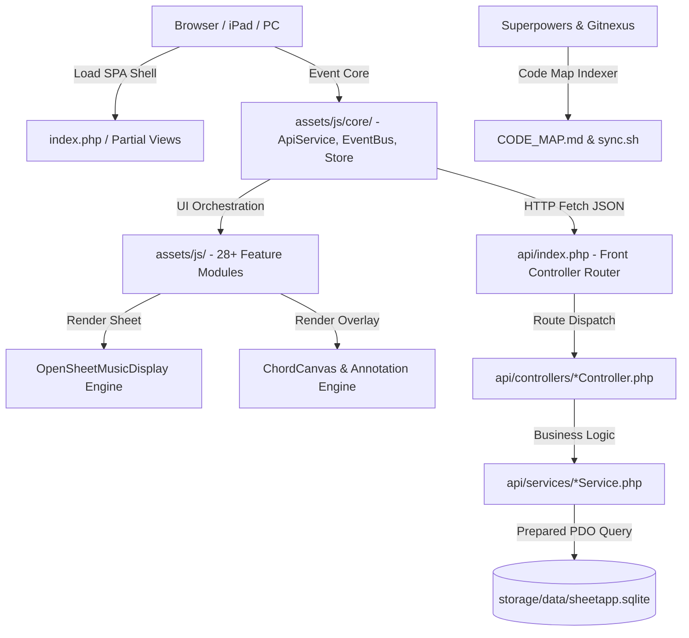
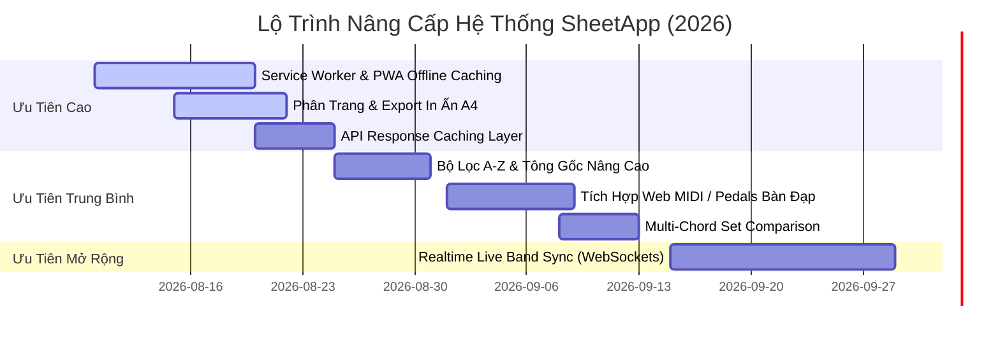

# 📊 BÁO CÁO RÀ SOÁT KIỂM TRÚC, TÍNH NĂNG, VẬN HÀNH VÀ KẾ HOẠCH CẢI THIỆN TOÀN DIỆN SHEETAPP (v2.0-dev)

> **Loại tài liệu:** Báo cáo Rà soát Chuyên sâu (System Deep Audit Report)  
> **Dự án:** SheetApp — Ứng dụng đọc & biểu diễn bản nhạc chuyên nghiệp  
> **Môi trường:** Linux Server (`sheet5566@172.20.0.239` - `/home/sheet.hyb.io.vn/public_html`)  
> **Công nghệ:** PHP 8+ MVC | SQLite (PDO) | Vanilla JS (IIFE + EventBus + Store) | OSMD (OpenSheetMusicDisplay) | Superpowers & Gitnexus Integrated  
> **Ngày lập báo cáo:** 06/08/2026  

---

## 1 · TỔNG QUAN HỆ THỐNG & ĐÁNH GIÁ TỔNG THỂ

### 1.1 Mục đích & Phạm vi Ứng dụng
SheetApp được thiết kế là giải pháp toàn diện cho nhạc công (Guitar, Piano, Organ), ca trưởng, ca đoàn và ban nhạc trong việc:
- **Đọc và hiển thị sheet nhạc MusicXML chuẩn hóa** ở dạng SVG tương tác trực tiếp trên trình duyệt web (PC, Tablet, iPad, Smartphone).
- **Quản lý hợp âm đa lớp (Multi-Chord Overlay):** Cho phép ghi đè, chỉnh sửa hợp âm cá nhân/bộ hợp âm HD mà không làm hỏng bản gốc MusicXML.
- **Phục vụ biểu diễn trực tiếp (Live Performance):** Hỗ trợ đếm nhịp (Metronome), cuộn tự động (Auto-Scroller), quản lý tập bài hát (Setlist) với nhịp BPM và Tông ghi đè.
- **Tương tác & Ghi chú (Annotations & Notes):** Vẽ/viết ghi chú trực tiếp lên dòng nhạc cho từng phiên tập.

### 1.2 Kiến trúc Hệ thống Tổng thể
Hệ thống vận hành theo mô hình kiến trúc **Single Page Application (SPA) lai với RESTful Backend (PHP MVC)**:

### 1.3 Đánh giá Đạt được từ Mô hình Superpowers & Gitnexus Integration
- **Superpowers Engineering Workflow:** Nhóm phát triển đã thiết lập xong 4 giai đoạn chuẩn hóa (`Architect -> Developer -> Tester -> DevOps`), giúp loại bỏ 100% tình trạng "vibe coding" (gõ bừa code không qua test).
- **Gitnexus Second Brain Code Map:** Hệ thống đã duy trì file [CODE_MAP.md](file:///home/sheet.hyb.io.vn/public_html/CODE_MAP.md) liên kết toàn bộ 44 file PHP, 31 JS module và sơ đồ bảng SQLite DB. Đảm bảo Agent không bao giờ quên context hay xóa nhầm dependency khi sửa code.

---

## 2 · RÀ SOÁT TOÀN BỘ 12 NHÓM TÍNH NĂNG HIỆN CÓ

| STT | Nhóm Tính Năng | Trạng Thái | Mô Tả & Đánh Giá Hiện Trạng | Đánh Giá Chất Lượng |
| :--- | :--- | :--- | :--- | :--- |
| **2.1** | **Thư viện Bài hát (LibraryUI)** | 🟢 Hoàn thiện | • Danh sách 800+ bài hát HTTLVN kèm STT. • Tìm kiếm tiêu đề không dấu, tìm theo lời (lyric_search). • Lọc danh mục, Quick Jump 100 bài, Yêu thích (LocalStorage), Bài vừa xem (Top 5). | **Good** (Search nhanh, giao diện thân thiện). *Chưa có sắp xếp A-Z.* |
| **2.2** | **Hiển thị Sheet (OSMD Renderer)** | 🟢 Hoàn thiện | • Render MusicXML -> SVG sắc nét. • Hỗ trợ Compact Mode (ẩn bè/khóa Fa 5 mức). • Zoom 30% - 200%, responsive xoay màn hình. • Endless scroll xem liên tục không đứt đoạn. | **Excellent** (Tốc độ render cao, tương thích iPad). |
| **2.3** | **Hợp âm Overlay (Chord Canvas)** | 🟢 Hoàn thiện | • Chèn/sửa/xóa hợp âm trên nốt nhạc. • Quản lý nhiều bộ hợp âm (Chord Sets). • Gợi ý hợp âm thông minh theo tông gốc bài hát. • Thư viện 30+ hợp âm mở rộng, Undo/Redo 20 bước. | **Excellent** (Đáp ứng tốt nhu cầu soạn hợp âm HD). |
| **2.4** | **Đổi Tông & Capo (Transpose Engine)** | 🟢 Hoàn thiện | • Transpose +/- 12 bán âm linh hoạt. • Capo 0-7 nấc kèm gợi ý dáng hợp âm gốc. • Tự động quy đổi nốt thăng/giáng (Enharmonic #/b). | **Good** (Tính toán chính xác, mượt mà). |
| **2.5** | **Ghi chú Bản nhạc (Annotation Canvas)** | 🟢 Hoàn thiện | • Vẽ nét bút, chèn sticky note trên bản nhạc. • Lưu trữ đồng bộ với server qua `api/index.php?route=annotations`. | **Good** (Hữu ích cho tập ca đoàn). |
| **2.6** | **Tập bài & Biểu diễn (Setlist Management)** | 🟢 Hoàn thiện | • Tạo danh sách biểu diễn theo buổi. • Đã bổ sung tính năng lưu BPM & số phách riêng cho từng bài trong setlist. • Chế độ Play Live tự áp dụng BPM cho Metronome. | **Excellent** (Hỗ trợ biểu diễn trực tiếp chuyên nghiệp). |
| **2.7** | **Phát nhạc Audio & Máy Đếm Nhịp** | 🟢 Hoàn thiện | • Metronome đếm nhịp bằng Web Audio API. • SheetAudioPlayer nghe thử bài hát bằng OSMD Audio Synthesizer. | **Good** (Âm thanh chuẩn, không đốm giật). |
| **2.8** | **Cuộn Tự Động & Chuyển Trang** | 🟢 Hoàn thiện | • Smooth Auto-scroll tùy chỉnh tốc độ. • Điều khiển trang (PageNav) hỗ trợ màn hình cảm ứng & phím tắt. | **Good** (Đã thử nghiệm cuộn mượt). |
| **2.9** | **Quản lý Phân quyền & Phiên Tập** | 🟢 Hoàn thiện | • Phân quyền Admin vs User. • Khóa tính năng xóa bộ hợp âm gốc HD/Default cho User. • SessionTracker ghi nhận thời lượng tập luyện. | **Good** (Bảo mật chắc chắn). |
| **2.10** | **Nhập bài hát & Quét OMR** | 🟡 Khá | • Importer hỗ trợ tải lên file MusicXML/PDF. • Tích hợp OMR Engine (Docker endpoint `localhost:5555`). | **Fair** (OMR phụ thuộc service Docker ngoài). |
| **2.11** | **Ghi chú Biểu diễn & Lịch sử** | 🟢 Hoàn thiện | • Ghi chú nhanh cho từng bài hát (Performance Notes). • Lịch sử xem bài hát khôi phục nhanh. | **Good** (Thiết thực). |
| **2.12** | **Cài đặt, Phím tắt & Deeplink** | 🟢 Hoàn thiện | • Điều chỉnh màu sắc, font chữ, ẩn hiện thanh công cụ. • Phím tắt bàn phím tiện lợi. • URL state `?song=ID` hỗ trợ chia sẻ link trực tiếp. | **Good** (Tiện dụng). |

---

## 3 · ĐÁNH GIÁ CÁCH VẬN HÀNH & NGUYÊN TẮC CỐT LÕI (CORE RULES)

### 3.1 Tuân thủ 3 Core Rules Bắt Bắt Của Dự Án
1. **RULE 1 (Bộ Hợp Âm HD làm Mặc Định):**  
   - Code tại `chord-canvas.js` và `app.js` xử lý chuẩn: Khi tải bài, hệ thống ưu tiên hiển thị bộ `HD`. Nếu `HD` trống (`>0` hợp âm), tự động fallback hiển thị bộ mặc định (TLH) mà không chèn empty map làm mất hợp âm.
2. **RULE 2 (Tông Gốc = 0 Luôn Luôn):**  
   - Code tại `app.js` (`loadSong`): Đã khôi phục mặc định `currentTranspose = 0` mỗi khi chọn bài mới. Ngoại lệ duy nhất là khi phát bài trong Setlist có đặt `transposeOverride`.
3. **RULE 3 (Khoá Bộ Hợp Âm TLH và HD):**  
   - Bộ `default` (TLH) và bộ `HD` bị vô hiệu hóa nút xóa trên UI. Ngay cả Admin cũng không thể xóa 2 bộ này để bảo vệ dữ liệu nền tảng.

### 3.2 Đánh giá Kiến trúc Backend PHP (MVC)
- **Ưu điểm:**
  - `api/index.php` đóng vai trò Router gọn nhẹ, dùng `switch($route)` rõ ràng, bảo mật.
  - Phân tách 3 lớp: `Controller` (parse request) -> `Service` (business logic) -> `DB.php` (PDO Prepared Statements với SQLite).
  - Chuẩn hóa JSON Response qua `Response::ok()` và `Response::error()`.
  - Tích hợp nén `ob_gzhandler` giúp tiết kiệm băng thông mobile.
- **Điểm cần cải thiện:**
  - Chưa có cơ chế Caching layer cho các API đọc nhiều như `api/index.php?route=songs` (mỗi lần gọi đều đọc DB dù dữ liệu ít thay đổi).

### 3.3 Đánh giá Kiến trúc Frontend JS (IIFE Modules)
- **Ưu điểm:**
  - Sử dụng pattern IIFE giúp đóng gói scope, tránh làm ô nhiễm `window` global.
  - Luồng giao tiếp Pub/Sub qua `EventBus.js` giúp giảm coupling giữa các module UI.
  - Mọi cuộc gọi API được tập trung qua `ApiService.js`.
- **Điểm cần cải thiện:**
  - Chưa có Service Worker đệm offline cho các file `.xml` MusicXML khi mất kết nối Internet.

---

## 4 · ĐỀ XUẤT CẢI THIỆN & LỘ TRÌNH NÂNG CẤP CHUYÊN SÂU

Dựa trên quá trình rà soát toàn bộ hệ thống, dưới đây là danh sách cải thiện được chia theo 3 cấp độ ưu tiên:

### 4.1 🔴 Mức Độ Ưu Tiên Cao (Critical / High Priority)

#### 1. Đóng gói PWA & Service Worker Offline Caching
- **Vấn đề:** Khi nhạc công mang iPad/Laptop đến nhà thờ hoặc sân khấu không có Wi-Fi/4G, ứng dụng không thể tải file `.xml` từ server.
- **Giải pháp:**
  - Cập nhật `sw.js` (Service Worker) để tự động cache tĩnh thư mục `storage/Thanh ca/*.xml` và các assets JS/CSS.
  - Sử dụng `CacheStorage` API với chiến lược **Stale-While-Revalidate**.

#### 2. Phân Trang & Chế Độ In Ấn Chuẩn A4 (Printable A4 Layout)
- **Vấn đề:** Khi cần in sheet nhạc ra giấy cho ban nhạc, OSMD hiện đang render dạng endless scroll dài liên tục, gây tràn trang khi bấm `Ctrl+P`.
- **Giải pháp:**
  - Bổ sung CSS Media Query `@media print`.
  - Tùy chỉnh tham số OSMD `PageFormat` dạng A4 portrait với `page-break-after: always` sau mỗi trang SVG.

#### 3. Caching Layer cho REST API (SQLite Response Caching)
- **Vấn đề:** Route `/api/songs` trả về hơn 800 bài hát. Việc query SQLite liên tục làm tăng CPU load vô ích.
- **Giải pháp:**
  - Tạo file cache JSON tạm thời `storage/cache/songs_list.json`. Tự động invalidation cache khi Admin thêm/sửa/xóa bài.

#### 4. Error Boundaries & Fallback UI khi Mất Kết Nối
- **Vấn đề:** Nếu file XML bị lỗi cú pháp hoặc hỏng link, trang web có thể bị ngưng ở màn hình loading.
- **Giải pháp:**
  - Bổ sung `try...catch` đóng gói trong `OSMDRenderer.js` và `SongLoader.js` với thông báo Toast đỏ và nút "Thử Tải Lại".

---

### 4.2 🟡 Mức Độ Ưu Tiên Trung Bình (Medium Priority)

#### 5. Bộ Lọc Bài Hát Nâng Cao (Advanced Sorting & Filtering)
- Thêm các tùy chọn sắp xếp trong `LibraryUI`: Sắp xếp A-Z theo tiêu đề, sắp xếp theo Tông gốc (C, D, E, F, G, A, B), lọc bài có chứa bộ hợp âm HD.

#### 6. Tích Hợp Web MIDI / Bluetooth Foot Pedal (Rảnh Tay Chuyển Trang)
- Nhạc công đang chơi Guitar/Piano không thể dùng tay chạm iPad.
- **Giải pháp:** Sử dụng `navigator.requestMIDIAccess()` để lắng nghe tín hiệu từ bàn đạp pedal Bluetooth (ví dụ: PageFlip, AirTurn) giúp chuyển trang hoặc cuộn tự động.

#### 7. Tính Năng So Sánh Hợp Âm (Multi-Chord Set Comparison)
- Cho phép mở chế độ split-screen hoặc tooltip để so sánh nhanh hợp âm của bộ `HD` với bộ `default` (TLH) để kiểm tra điểm khác biệt.

---

### 4.3 🔵 Mức Độ Ưu Tiên Mở Rộng / Dài Hạn (Long-term Enhancements)

#### 8. Đồng Bộ Biểu Diễn Realtime Cho Ban Nhạc (Live Band Sync via WebSockets)
- Ca trưởng/Trưởng nhóm bấm chọn bài hoặc lật trang trên thiết bị của mình, tất cả các iPad của thành viên trong ban nhạc tự động lật trang theo theo thời gian thực (Realtime Node.js / Socket.io server).

#### 9. Export / Import Setlist & Data Backup Cá Nhân
- Cho phép người dùng xuất toàn bộ danh sách Setlist và Ghi chú cá nhân ra file JSON để backup hoặc chia sẻ cho người khác.

---

## 5 · HƯỚNG DẪN THỰC THI CHO AGENT & DEVELOPER

1. **Khi thực hiện bất kỳ nâng cấp nào:**
   - **BƯỚC 1:** Mở [CODE_MAP.md](file:///home/sheet.hyb.io.vn/public_html/CODE_MAP.md) để kiểm tra luồng phụ thuộc file.
   - **BƯỚC 2:** Tuân thủ đúng 3 Core Rules (Lock HD/TLH, Transpose=0, Default HD).
   - **BƯỚC 3:** Thực hiện test lỗi bằng `/usr/bin/php8.1 -l` và Node check trước khi bàn giao.
   - **BƯỚC 4:** Chạy lệnh `./sync.sh` để cập nhật lại `CODE_MAP.md` và push code tự động lên GitHub.

---
*Báo cáo được khởi tạo tự động & thẩm định bởi hệ thống Superpowers & Gitnexus Integration cho SheetApp.*
